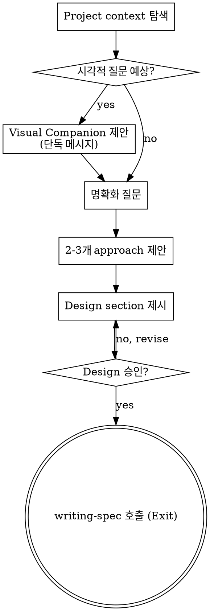

# Brainstorming Ideas Into Designs

자연스러운 collaborative dialogue를 통해 아이디어를 완성된 design과 spec으로 변환한다.

먼저 현재 project context를 이해한 뒤, 한 번에 하나씩 질문을 던져 아이디어를 다듬는다. 무엇을 만들지 이해했다면 design을 제시하고 사용자 승인을 받는다.

## 입력

| 필드 | 타입 | 필수 | 설명 |
|---|---|---|---|
| (없음) | `none` | — | 진입 스킬. 사용자 발화·세션 컨텍스트가 사실상의 입력. |

<HARD-GATE>
design을 제시하고 사용자 승인을 받기 전까지는 어떠한 exec skill도 호출하지 않고, 어떠한 코드도 작성하지 않으며, project scaffolding도 수행하지 않고, exec 관련 행동 자체를 하지 않는다. 이 규칙은 단순해 보이는 모든 project에도 예외 없이 적용된다.
</HARD-GATE>

## Anti-Pattern: "이건 너무 단순해서 design이 필요 없어"

모든 project는 이 process를 거친다. todo list, single-function utility, config 변경 — 전부 포함이다. "단순한" project일수록 검증되지 않은 가정이 가장 큰 낭비를 만든다. design 자체는 짧아도 된다 (정말 단순하면 몇 문장이면 족함). 그러나 반드시 제시하고 승인을 받아야 한다.

## Checklist

다음 항목을 각각 task로 만들고 순서대로 완료해야 한다.

1. **Project context 탐색** — 파일, 문서, 최근 commit 확인
2. **Visual Companion 제안** (시각적 질문이 예상되는 경우) — 단독 메시지로 제안. 명확화 질문과 합치지 않는다. 아래 Visual Companion 섹션 참고.
3. **명확화 질문** — 한 번에 하나씩. 목적·제약·성공 기준을 이해한다.
4. **2-3개 approach 제안** — trade-off와 추천안을 함께
5. **Design 제시** — 복잡도에 맞게 section 크기를 조절하고, 각 section 후에 사용자 승인을 받는다
6. **`writing-spec` 호출** — design 합의 결과를 넘기고 spec 작성·self-review·사용자 검토 게이트·`writing-plan` 인계는 모두 writing-spec에 위임한다 (자동 흐름).

## Process Flow

**Terminal state는 design 합의 후 `writing-spec` 호출**이다. spec 작성·self-review·사용자 검토 게이트·`writing-plan` 인계는 writing-spec이 처리한다. (탐색 중 정보 수집용 단발 스킬 호출은 자유.)

## The Process

**아이디어 이해하기:**

- 먼저 현재 project 상태를 확인한다 (파일, 문서, 최근 commit)
- 세부 질문을 하기 전에 scope를 먼저 판단한다. 요청이 여러 독립 subsystem(예: "chat + file storage + billing + analytics가 있는 platform을 만들어")을 포함한다면 즉시 이를 지적한다. decomposition이 필요한 project의 세부를 파고드는 데 질문을 낭비하지 않는다.
- Project가 single spec으로 담기에 너무 크다면, 사용자가 sub-project로 쪼개도록 돕는다 — 독립 조각은 무엇이고, 어떻게 연결되며, 어떤 순서로 만들지. 그 다음 첫 번째 sub-project를 일반 design flow로 brainstorm한다. 각 sub-project는 독립된 spec → plan → exec → review cycle을 가진다.
- Scope가 적절한 project라면, 한 번에 하나씩 질문하여 아이디어를 다듬는다
- 가능하면 객관식 질문을 선호하되, 열린 질문도 괜찮다
- 메시지당 질문은 하나만 — 한 주제에 탐색이 더 필요하면 여러 질문으로 쪼갠다
- 이해의 초점: 목적, 제약, 성공 기준

**Approach 탐색:**

- Trade-off와 함께 2-3개 approach를 제안한다
- 대화하듯 option들을 제시하고, 추천안과 근거를 함께 말한다
- 추천 option을 먼저 제시하고 이유를 설명한다

**Design 제시:**

- 무엇을 만들지 이해했다고 판단되면 design을 제시한다
- 각 section의 크기를 복잡도에 맞춘다: 단순하면 몇 문장, 뉘앙스가 많으면 200-300단어까지
- 각 section 후에 "여기까지 맞나요?"를 묻는다
- 커버할 내용: architecture, component, data flow, error handling, testing
- 납득되지 않는 부분이 있으면 언제든 이전 단계로 돌아가 명확화한다

**Isolation과 명료성을 위한 design:**

- System을 작은 unit으로 쪼갠다 — 각 unit은 명확한 목적 하나, 잘 정의된 interface를 통해 통신, 독립적으로 이해·테스트 가능해야 한다
- 각 unit에 대해 다음을 답할 수 있어야 한다: 무엇을 하는가? 어떻게 쓰는가? 무엇에 의존하는가?
- 내부를 읽지 않고도 unit이 무엇을 하는지 이해할 수 있는가? consumer를 깨지 않고 내부를 바꿀 수 있는가? 아니라면 boundary를 다시 잡는다.
- 경계가 잘 잡힌 작은 unit은 에이전트도 다루기 쉽다 — context에 한 번에 담을 수 있는 코드에 대해 더 잘 추론하고, 파일이 집중되어 있을수록 편집이 안정적이다. 파일이 커진다는 건 너무 많은 일을 한다는 signal이다.

**기존 codebase에서 작업할 때:**

- 변경을 제안하기 전에 현재 구조를 탐색한다. 기존 pattern을 따른다.
- 기존 코드에 이번 작업에 영향을 주는 문제(너무 커진 파일, 불분명한 boundary, 뒤엉킨 책임)가 있다면, design 안에 **타깃된** 개선을 포함한다 — 좋은 개발자가 자기가 건드리는 코드를 조금씩 개선하듯.
- 관련 없는 refactoring은 제안하지 않는다. 현재 목표에 집중한다.

## Design 이후

**Spec 작성은 `writing-spec`에 위임:**
Design 합의가 끝나면 `writing-spec` 스킬을 호출한다. 파일 경로 규약(`.atom-flow/spec/{date}-{feature_name}-spec.md`), self-review, 사용자 검토 게이트, `writing-plan`으로의 인계는 모두 writing-spec이 책임진다. brainstorming은 design 합의 + writing-spec 호출에서 끝낸다.

**완료 안내 (Terminal state):**

design이 승인되면 `writing-spec`을 직접 호출한다. brainstorming 본문 안에서 spec 파일을 직접 쓰지 않는다 — 책임 단일화.

**Terminal output schema** (using-atom-flow §6.5.2 인용):
`{ status: success, summary: "design agreed for <feature>", next: writing-spec, artifacts: [] }`

design notes는 brainstorming 산출물이 아니라 `writing-spec`의 입력으로 전달되어 spec.md에 기록된다. brainstorming 자체의 산출물 path는 없다.

## Key Principles

- **한 번에 한 질문** — 여러 질문을 한꺼번에 던져 사용자를 압도하지 않는다
- **객관식 우선** — 가능하면 객관식이 열린 질문보다 답하기 쉽다
- **YAGNI 철저히** — 모든 design에서 불필요한 feature를 가차없이 제거한다
- **Alternative 탐색** — 결론 내리기 전에 항상 2-3개 approach를 제안한다
- **Incremental validation** — design을 제시하고 승인을 받은 뒤 다음으로 이동한다
- **유연하게** — 납득되지 않는 부분이 있으면 돌아가서 명확화한다

## Visual Companion

Brainstorming 중 mockup, diagram, 시각적 option을 보여주는 browser 기반 companion이다. **모드가 아니라 도구**로 제공된다. companion을 수락한다는 것은 "시각적 처리가 도움이 되는 질문에 쓸 수 있다"는 뜻이지, 모든 질문이 browser를 거친다는 뜻이 아니다.

**Companion 제안:** 시각적 content(mockup, layout, diagram)가 뒤따를 것으로 예상되면 한 번만 제안하여 consent를 받는다:

> "지금부터 다루는 내용 중 일부는 글보다 web browser에서 보여드리는 게 이해가 쉬울 수 있습니다. mockup, diagram, 비교 화면 같은 걸 만들어 드릴 수 있어요. 이 기능은 아직 새롭고 token을 꽤 씁니다. 시도해보시겠어요? (로컬 URL을 열어야 합니다)"

**이 제안은 반드시 단독 메시지여야 한다.** 명확화 질문, context 요약, 기타 어떤 내용과도 합치지 않는다. 메시지에는 위 제안 문구만 담는다. 사용자 응답을 기다리고, 거절하면 text-only brainstorming으로 진행한다.

**질문별 판단:** 사용자가 수락한 뒤에도, 각 질문마다 browser를 쓸지 terminal을 쓸지 결정한다. 기준: **사용자가 읽는 것보다 보는 쪽이 더 잘 이해되는 질문인가?**

- **Browser 사용**: 본질이 시각인 content — mockup, wireframe, layout 비교, architecture diagram, side-by-side visual design
- **Terminal 사용**: 본질이 텍스트인 content — requirement 질문, 개념적 선택, trade-off list, A/B/C/D 텍스트 option, scope 결정

UI 주제에 대한 질문이라고 해서 자동으로 visual question이 되지는 않는다. "이 맥락에서 personality가 무슨 뜻이냐"는 개념적 질문 — terminal. "어떤 wizard layout이 더 낫냐"는 visual question — browser.

Companion에 동의했다면 진행 전에 상세 가이드를 먼저 읽는다:
`skills/brainstorming/visual-companion.md`
